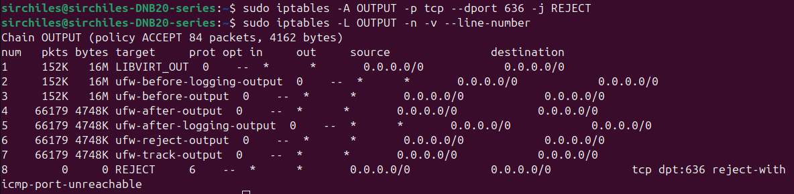
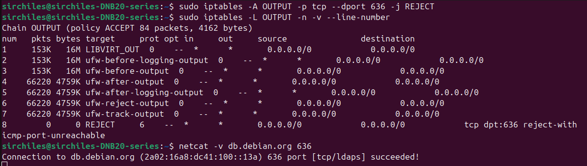

# LDAPS Connection Failure

## Objective
Show that blocking port 636 stops systems from reaching a directory over LDAPS, even before any login or authentication can happen

## Environment
- OS: Ubuntu Linux 22.04
- Tools: `iptables`, `ip6tables`, `netcat`, `openssl` `conntrack`
- Network: Local workstation with Wi-Fi

## Target
Public directory service at `db.debian.org` accessed using LDAPS on port 636 

## Scenario
LDAPS still works after adding correct firewall rule

### Baseline
Action:
- Tested connectivity to LDAPS port 
- Tested secure connection

Commands:
```bash
netcat -v db.debian.org 636
openssl s_client -connect db.debian.org:636
```
Result:
- Connection to port 636 succeeded
- TLS handshake succeeded

### Setup
Action:
- Added outbound firewall rule to block port 636
- Verified new rule exists in table

Commands:
```bash
sudo iptables -A OUTPUT -p tcp --dport 636 -j REJECT
sudo iptables -L OUTPUT -n -v --line-number
```

Result:
- Firewall rule appeared in OUTPUT chain (see Figure 1)

### Expected Behavior
- LDAPS connection on port 636 should fail once port is blocked
- Failure should occur before TLS or reaching the directory

### Observed Result

#### Initial Retest
Action:
```bash
netcat -v db.debian.org 636
```

Result:
- Connection still succeeded (See Figure 3)
- Firewall rule packet/byte counters still at zero

#### Investigation 

**IP Version Check**
Action:
- Forced IPv4 and IPv6 connections separately

Command:
```bash
netcat -4 -v db.debian.org 636
netcat -6 -v db.debian.org 636
```

Result:
- Both IPv4 and IPv6 connections succeeded
- Firewall rule counters still at zero

**Connection State Check**
Action:
- Cleared existing connection tracking state
- Retested LDAPS connectivity

Command:
```bash
sudo conntrack -F
netcat -v db.debian.org 636
```

Result:
- Connection still succeeded
- Firewall rule counters still at zero

**Firewall Rule Order Review**
Action:
- Listed OUTPUT chain with rule order and counters
- Removed original firewall blocking rule
- Re-inserted blocking rule at the top of OUTPUT chain (See Figure 2)
- Added equivalent IPv6 rule
- Cleared connection tracking again

Command:
```bash
sudo iptables -L OUTPUT -n -v --line-number
sudo iptables -D OUTPUT 8
sudo iptables -I OUTPUT 1 -p tcp --dport 636 -j REJECT
sudo ip6tables -I OUTPUT 1 -p tcp --dport 636 -j REJECT
sudo conntrack -F
```

#### Final Retest
Action:
```bash
netcat -v db.debian.org
```

Result:
- Client attempted connections using both IPv6 and IPv4 addressed and both were refused (See Figure 4)
- Firewall rule packet and byte counters increased

## Analysis
Although a firewall rule was added to block port 636, the LDAPS connection still worked because the traffic was not being checked against that rule. IPv6 traffic was not initially covered, and existing connection state allowed the connection to succeed, which is why the rule counters stayed at zero. After the rule was moved to be evaluated first, applied to both IPv4 and IPv6, and existing connections were cleared, outbound traffic to the port was rejected immediately, preventing LDAPS communcation before any secure session could start.

**Key Findings:**
- Firewall rule order and connection state must be checked when a change has no effect
- Clients may try more than one address automatically, so blocking a single path doesn't guarantee failure 

## Cleanup
Action:
- Removed the blocking firewall rules
- Cleared connection tracking state
- Retested connectivity

Command:
```bash
sudo iptables -D OUTPUT 1
sudo ip6tables -D OUTPUT 1
sudo conntrack -F
netcat -v db.debian.org 636
```
Result:
- Connection to port 636 succeeded

## What I Validated
- IPv6 connections still worked after an IPv4 outbound block rule was added
- Existing connection state allowed LDAPS to keep working until it was cleared
- Moving the block rule to the top to be evaluated earlier caused the failure

## Evidence
*Figure 1:*


*Figure 2:*


*Figure 3:*


*Figure 4:*


