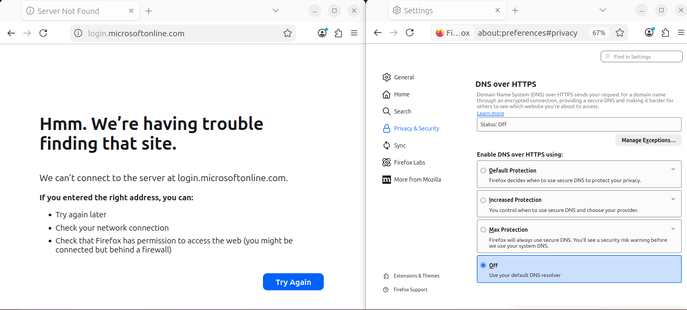
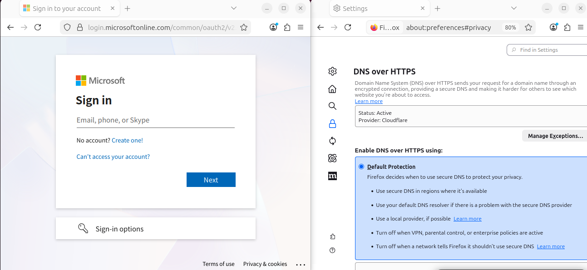
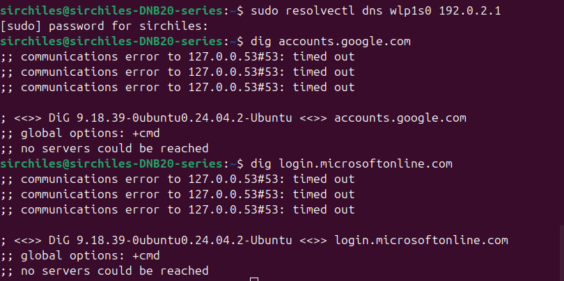
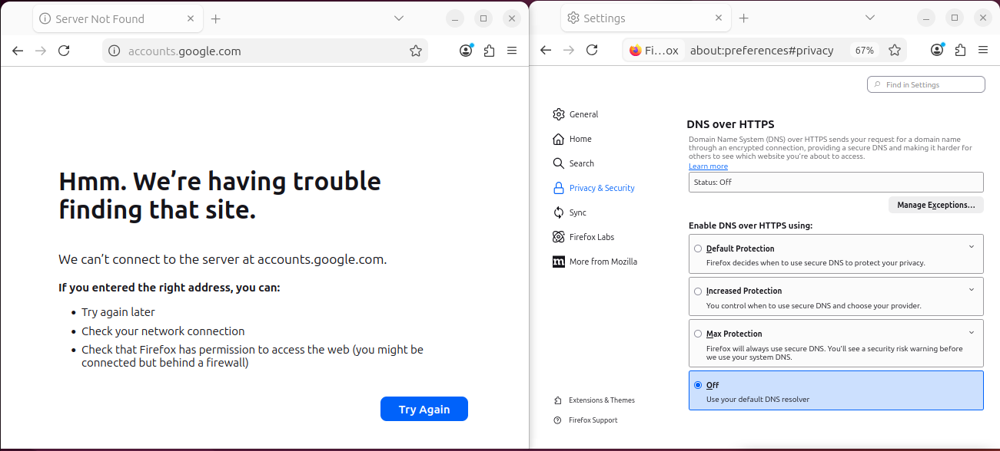

# Identity Reachability - DNS Failure

## Objective
- Understand how DNS affects access to identity login pages before authentication, MFA, or protocols ever happen
- Observe what breaks when DNS is misconfigured

## Environment
OS: Ubuntu Linux
Browser: Firefox
Network: Local Wi-Fi interface (NIC)

## Identity Endpoints
- `login.microsoftonline.com`
- `accounts.google.com`
- Both tested using same failure scenarios

## What I Tested

### Baseline
Action:
- Ran `dig` command to query DNS resolution for the endpoints
- Ran `curl` command with each hostname to confirm HTTPS connection
- Tested browser access to login pages

Result:
- (M) returned CNAME records pointing to other domains (traced CNAME chain to final A record with IP address)
- (G) Single A record with IP address
- HTTPS connectivity succeeded
- Login pages loaded successfully in browser

### DNS Failure (Resolver non-responsive)
Action:
- Ran `resolvectl` command to change system DNS to a non-responsive IP address (`192.0.2.1`)
- Ran `dig` command again
- Tested browser access to login pages

Result:
- `dig` failed immediately with no IP address returned (see Figure 1)
- Login pages still succesfully loaded in the browser

Action:
- Disabled DNS over HTTPS (DoH) in browser settings
- Retested browser access to login page

Result:
- Login page failed to load
- Browser behavior matched CLI output

### DNS Failure (Incorrect resolution)
Action:
- Modified hosts file to have endpoints resolve to localhost IP (`127.0.0.1`)
- Tested DNS resolution and HTTPS connection

Result:
- Name resolution succeeded
- HTTPS connection failed immediately

### Compare resolvers
Action:
- Queried public DNS resolvers directly
    - Google (`8.8.8.8`)
    - Cloudflare (`1.1.1.1`)

Result:
- DNS resolution succeeded when bypassing local DNS
- Confirmed issue was local to system config

## Observations
- Identity endpoints can rely on multiple DNS records before reaching an IP address
- DNS resolution by itself does not guarantee a successful connection
- When system DNS was broken, `dig` failed for both endpoints
- System DNS failure did not immediately stop login page from loading in browser (see Figures 2 and 5)
- Browser behaved differently once it was forced to rely on misconfigured local DNS (see Figures 3 and 6)

## Analysis
DNS must be resolved before a browser can reach a login page. When DNS fails, the client doesn't know where to send the login request, so authentication never actually begins. When I misconfigured system DNS, I expected the page to fail immediately, but it didn't. I eventually figured out the browser was still able to load the page because it was resolving DNS on its own using DNS over HTTPS (DoH), bypassing system DNS. The login page failed to load after I disabled DoH and forced the browser to rely on system DNS. This showed me that clients can choose different resolution paths (e.g. OS, broswer, cache, persistent connections) and that failures depend on which path was taken.

## Evidence
### Endpoint 1 - login.microsoftonline.com
*Figure 1: System DNS resolution failure (CLI)*

*Figure 2: Browser loads page before DoH disabled*

*Figure 3: Browser fails after DoH disabled*

### Endpoint 2 - accounts.google.com
*Figure 4: System DNS resolution failure (CLI)*

*Figure 5: Browser loads page before DoH disabled*

*Figure 6: Browser fails after DoH disabled*

